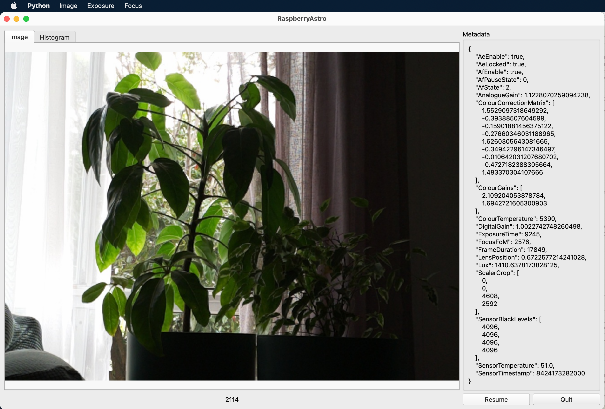

# RaspberryPi Remote Camera Viewer

I needed a way to view images from a camera running on a remote and headless RaspberryPi. This is the tool
built for that job.

There's a server process that runs on the Pi and a Qt based viewer that runs on the client machine. I use
it on a MacBook Pro. It should work on Windows as well, but I've never tested in that environment.

## Quick Start

### Server - RaspberryPi

Clone this repostory and run the script `requirements.sh`. This installs all the standard packages
needed using `apt`.

To run the server:

    $ ./rcam-server.py -h
    usage: rcam-server.py [-h] [-p API_PORT] [-c CAMERA_ID] [-m MODE] [-f MAX_FPS] [-e EXPOSURE_TIME]
                          [-g ANALOGUE_GAIN] [--hflip] [--vflip] [--preview]
                          
    options:
      -h, --help            show this help message and exit
      -p API_PORT, --api-port API_PORT
                            port to bind api to
      -c CAMERA_ID, --camera-id CAMERA_ID
                            the camera to connect to
      -m MODE, --mode MODE  the camera mode
      -f MAX_FPS, --max-fps MAX_FPS
                            the maximum fps
      -e EXPOSURE_TIME, --exposure-time EXPOSURE_TIME
                            the exposure time in microseconds
      -g ANALOGUE_GAIN, --analogue-gain ANALOGUE_GAIN
                            the analogue gain
      --hflip               flip the image horizontally
      --vflip               flip the image vertically
      --preview             run the camera preview on attached monitor

The simplest version would be:

    $ ./rcam-server.py -m 1
    listening at tcp://127.0.0.1:8089
    listening at tcp://192.168.1.37:8089
    listening at tcp://10.42.0.1:8089
    pub_server: start
    api_server: start

This sets the camera into mode '1' and then starts listening on the listed URLs. 

To see the modes your camera supports, you can use the `cam-info.py` script. This prints out all the details of all the cameras
connected to you system - usually just the one, but the Pi5 can have two.

### Client - MacBook Pro

Once you have cloned this repo, build a virtualenv and install the necessary packages:

    $ python3 -m venv pyenv
    $ pip install -r requirements-client.txt

Then run the viewer, passing it the URL to connect to. For example:

    $ ./rcam-viewer.py tcp://192.168.1.37:8089

This displays the application as shown below. The image is in the main part of the window, with the
image metadata displayed on the right.

You can toggle between fitting the image by cropping and scaling. You can also manually adjust the exposure and 
if you have one of the v3 camera modules, you can also manually adjust the focus.

The available controls are all accessible from the menus with shortcuts shown.

There is also a histogram view. It generates the histogram based on a central region of the image. I find it 
useful (sometimes) when manually setting the exposure.

## Optional Setup

### Pi Hotspot

I often use this where this no wifi network so I have setup the wifi on the Pi to be a hotspot. When I'm at home,
I use the wired interface, but out and about, I connect my laptop to the hotspot.

It's very easy to do with network manager as described
[here](https://www.raspberrypi.com/documentation/computers/configuration.html#host-a-wireless-network-on-your-raspberry-pi)

To create the hotspot:

    $ sudo nmcli device wifi hotspot band bg con-name <con-name> ssid <ssid-name> password <your-password>

For example:

    $ sudo nmcli device wifi hotspot band bg con-name piwifi ssid piwifi password mysupersecretpassword

You will probably want to have this start automatically at boot time. First, turn off 'autoconnect' for any
existing wifi networks you might have. If you setup your Pi with the official imager application and setup
connection to a wifi network, there will be a connection called 'preconfigured' 

    $ sudo nmcli conn modify preconfigured autoconnect no

And now you can enable autoconnect for your hotspot.

    $ sudo nmcli conn modify <con-name> autoconnect yes

Once this is done, the hotspot will start on boot.

